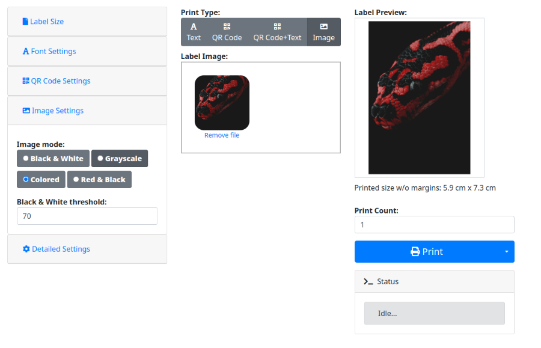

# brother_ql_web

This is a web service to print labels on Brother QL label printers.

You need Python 3 or Docker for this software to work.

The web interface is [responsive](https://en.wikipedia.org/wiki/Responsive_web_design).
There's also a screenshot showing [how it looks on a smartphone](./screenshots/Label-Designer_Phone.png)

## Fork info

There are a lot of forks of the `brother_ql` and `brother_ql_web` repos from [pklaus](https://github.com/pklaus/brother_ql). I tried to cherry pick a fairly recent and well maintainable state by using [matmair/brother_ql-inventree](https://github.com/matmair/brother_ql-inventree) as a dependency for communicating with the printers and [tbnobody/brother_ql_web](https://github.com/tbnobody/brother_ql_web) as a base for the frontend as there have been a few fixes and improvements implemented over there.

For now I have added Docker support and the ability to print red images on supported paper/printers.



### Label Modes

The designer supports several rendering modes:

-   **Text / QR / Image** – traditional label flows with live preview.
-   **Markdown** – render rich text (headings, tables, lists) with optional paged slicing, rotated layouts, forced page breaks (`---PAGE---`), and auto-preview.

### Additional Features

-   Print text as QR Code
    -   Add text to QR Code
    -   Change size of QR Code
-   Upload files to print
    -   .pdf, .png and .jpg files
    -   automatically convertion to black/white image
-   Change print color for black/white/red labels
-   Print lables multiple times
    -   Cut every label
    -   Cut only after the last label
-   Migrated GUI to Bootstrap 4
-   Make preview for round labels.. round
-   Print images on red/black paper
-   Dockerized
-   **Multi-Printer Support**
    -   Manage multiple printers (local and remote) via web UI
    -   Forward print jobs to remote brother_ql_web instances
    -   Per-print printer selection
    -   Persistent printer configurations

#### Label Designer Enhancements

-   Markdown printing now supports smarter pagination:
    -   Rotated markdown automatically enables paged mode and keeps page numbers upright after slicing.
    -   Use the `---PAGE---` marker in paged markdown to force an explicit page break.
    -   Standard-orientation markdown renders within the printable width and hides page-number controls.
-   A Markdown "Auto render preview" toggle mirrors the live-preview experience of the other print modes.
-   Font size inputs are interpreted as typographic points; the UI label reflects this (`Font Size (pt)`).
-   Slicing, footer space, and margin handling have been tightened for both standard and rotated markdown previews.

### Run via Docker

You can pull the image from `davidramiro/brother-ql-web` on Docker Hub.
You have to pass your printer model as `--model` argument. At the end of the arguments you have to add your device socket (linux kernel backend), USB identifier (pyusb backend) or network address (TCP).
Please note you might have to pass your device to the container via the `--device` flag.

Example command to start the application, connecting to a QL-800 on `/dev/usb/lp0`, setting label size to 62mm:

```bash
docker run -d \
    --restart=always \
    --name=brother-ql-web \
    -p 8013:8013 \
    --device=/dev/usb/lp0 \
    -v brother-ql-data:/app/instance \
    davidramiro/brother-ql-web:latest \
    --default-label-size 62 \
    --model QL-800 \
    file:///dev/usb/lp0
```

**Note:** The `-v brother-ql-data:/app/instance` volume mount ensures printer configurations persist across container restarts.

To build the image locally:

```bash
git clone https://github.com/davidramiro/brother_ql_web.git
cd brother_ql_web
docker buildx build -t brother-ql-web .

# alternatively, if buildx is not available
docker build -t brother-ql-web .
```

### Usage

Once it's running, access the web interface by opening the page with your browser.
If you run it on your local machine, go to <http://localhost:8013>.
You will then be forwarded by default to the interactive web gui located at `/labeldesigner`.

All in all, the web server offers:

-   a Web GUI allowing you to print your labels at `/labeldesigner`,
-   an API at `/api/print/text?text=Your_Text&font_size=100&font_family=Minion%20Pro%20(%20Semibold%20)`
    to print a label containing 'Your Text' with the specified font properties.

### Markdown API

You can render markdown directly through the JSON endpoint:

-   `POST /api/markdown/preview`

Request body (all values optional unless noted):

| Key | Type | Notes |
| --- | --- | --- |
| `markdown` | string | **Required** – the markdown source. Use `---PAGE---` on its own line to force a manual break when paged mode is active. |
| `label_size` | string | Brother media identifier (e.g. `62`, `62_red`). Defaults to the server configuration. |
| `orientation` | `"standard"` \\| `"rotated"` | Rotated automatically enables paged slicing. |
| `paged` | bool | Enable paged mode. Rotated requests ignore `false` and page automatically. |
| `slice_mm` | float | Slice height (mm) when paged mode is on. |
| `footer_mm` | float | Extra footer room on each slice (mm); automatically expanded if page numbers are drawn. |
| `page_numbers` | bool | Show numbering footer (only honored in rotated mode). |
| `page_circle`, `page_count`, `page_number_mm` | bool/float | Footer styling options. |
| `align` | `left` \\| `center` \\| `right` | Paragraph alignment. |
| `margins` | object | Optional `{top_mm, bottom_mm, left_mm, right_mm}` overrides. |
| `font_family`, `font_style`, `font_size` | string / string / float | Fonts must exist in the server's catalog; `font_size` is specified in points. |
| `line_spacing` | integer | Percentage (100 = single spacing). |

Response:

```json
{
  "pages": ["<base64 image>", "<base64 image>", ...]
}
```

Each base64 string is a PNG of one label slice, matching the behaviour of the web preview.

### Markdown Syntax

The renderer is based on Python-Markdown but tuned for label printing. Supported block features include headings (`#`, `##`, `###`), paragraphs, unordered/ordered lists, fenced code blocks, block quotes, tables with alignment headers, and forced page breaks (`---PAGE---`). Inline emphasis supports bold (`**text**`), italic (`*text*`), bold italic (`***text***`), inline code (`` `code` ``), and nested combinations. The output is rendered at 300 dpi using the selected font family/style and observed margins.

**Tip:** because font sizes are now specified in points, a 12 pt setting produces text roughly 4.2 mm tall on the Brother QL's 300 dpi print head (`12 / 72 * 25.4`).

### Multi-Printer Management

The application supports managing multiple printers (local and/or remote) through a web-based interface.

#### Features

- **Local Printers**: Connect to Brother QL printers via USB, network (TCP), or other local connections
- **Remote Printers**: Forward print jobs to other brother_ql_web instances over HTTP
- **Web UI Management**: Add, edit, delete, and configure printers at `/labeldesigner/printers`
- **Default Printer**: Set a default printer for quick access
- **Per-Print Selection**: Choose which printer to use for each print job
- **Persistent Storage**: Printer configurations are stored in `/app/instance/printers.json` (persist with Docker volumes)

#### Managing Printers

1. Navigate to `/labeldesigner/printers` in your browser
2. Click "Add New Printer" and configure:
   - **Local Printer**: Specify model (e.g., QL-800) and device (e.g., `file:///dev/usb/lp0` or `tcp://192.168.1.100`)
   - **Remote Printer**: Provide the URL of another brother_ql_web instance (e.g., `http://192.168.1.100:8013`)
3. Set a default printer (optional)
4. Use the printer selector dropdown in the main UI to choose which printer to use

#### Example Use Cases

- **Multiple Locations**: Configure remote printers in different offices/rooms
- **Backup Printer**: Set up a fallback printer when the primary is offline
- **Different Label Types**: Use different printers for different label sizes or colors
- **Centralized Management**: Run one instance as a "manager" that forwards to multiple physical printers

### License

This software is published under the terms of the GPLv3, see the LICENSE file in the repository.

Parts of this package are redistributed software products from 3rd parties. They are subject to different licenses:

-   [Bootstrap](https://github.com/twbs/bootstrap), MIT License
-   [Font Awesome](https://github.com/FortAwesome/Font-Awesome), CC BY 4.0 License
-   [jQuery](https://github.com/jquery/jquery), MIT License
-   [Flask](https://flask.palletsprojects.com/), BSD License
-   [Jinja2](https://github.com/pallets/jinja), BSD License
-   [Python-Markdown](https://python-markdown.github.io/), BSD 3-Clause License
-   [Poppler](https://poppler.freedesktop.org/), GPL License (used via `poppler-utils` for PDF imports)
-   Font packages bundled in the Docker image:
    -   [DejaVu](https://dejavu-fonts.github.io/), Bitstream Vera License / Public Domain
    -   [Liberation Fonts](https://github.com/liberationfonts/liberation-fonts), SIL Open Font License 1.1
    -   [Droid Sans](https://github.com/android/platform_frameworks_base/tree/master/data/fonts), Apache License 2.0
    -   [Terminus](http://terminus-font.sourceforge.net/), SIL Open Font License 1.1
    -   [Inconsolata](https://github.com/googlefonts/Inconsolata), SIL Open Font License 1.1
    -   [Noto](https://github.com/notofonts/noto-fonts), SIL Open Font License 1.1
